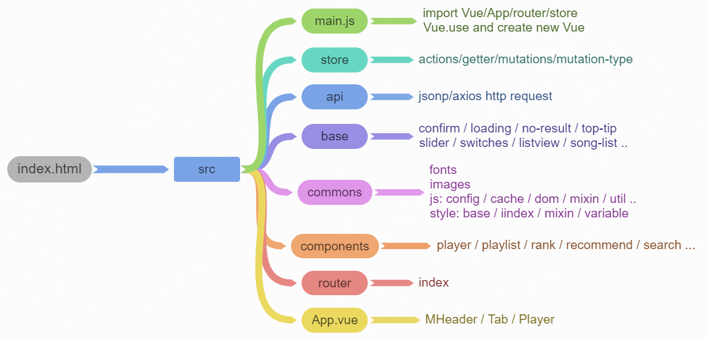

### Music-Player-Vue

------

  [](https://standardjs.com)

##### Intro

A Music Player made with Vue, learning purpose.

This player get the online music data from the API of QQ Music, and It has the following features:

- Browse Songs, Albums, Artists and Top lists
- Create and edit playlists
- Three different play modes - Sequence / Random / Loop
- Lyric support
- Search support
- Cache, save playing history and search history


##### 

##### Preview

More details, please click 👉  [here](http://47.104.228.220:9000/#/recommend) for online preview.


#####

##### Libraries and tools used in the project

- [x] ES6 / CSS3

- [x] Vue, Vuex, Vue Router and Vue-CLI (webpack)

  ---- Vuex: manage the states, share states from different components, mutations and actions to modify states.

  ---- Vue Router: use router push, router to, router-link to implement the page jumping. 

- [x] Lyric-Parser and BetterScroll

  ---- handle the scroll module

- [x] JSONP / AXIOS

  ---- handle http requests and CORS

- [x] Node.js and Express

  ---- Build the server in the cloud

- [x] Mixin, Debounce and Code spliting

  ---- use scss mixin and vue mixin to improve component availability 

  ---- use debounce to save the number of requests.

##### 

##### UI

- Suggest
  - Slider
  - Disc (suggested albums)
- Singer
  - Singer details
  - Music list
- Top List
  - ranking 
- Search
  - Hot Key
  - Search Result / Search History
- Player 
  - Progress bar / Progress circle
  - Lyric / Disk
- User Center
  - Play history
  - Favorite List





##### 

##### Difficulties encountered 

```
1. v-for refs
refs is not reactive, and v-for is in-patch insert
2. webpack.dev.config
webpack uses express as default
insert app.use in before
3. audio play error
should handle Promise
4. Constructor
base components only handle basic things
like new a class or emit an event
5. Vuex mutate state
array should use slice() to make a copy
6. Make proper data structure
maintain the playlist and sequencelist
handle edge cases always
set flag and watch proper data
7. scroll
should recalculate the clientHeight after dom change, or use the this.$nextTick
```

